# Khoroch — Personal Ledger Manager

Solution for **LofiStack Hackathon 2026 — P12**

*Khoroch* (খরচ) is Bengali for "expense" — the word a user of this app would actually reach for.

## Project information

| | |
| --- | --- |
| **Team** | Logarithm |
| **Team ID** | `LSH26-T033` |
| **Problem** | `P12 — Personal Ledger Manager` (Tier 02) |
| **Live application** | <!-- TODO: paste the deployed URL here before submitting --> |
| **Repository** | https://github.com/AuvroIslam/lsh26-t033-p12 |
| **Demo video** | Optional link, maximum three minutes |

> Judges will evaluate only the exact commit SHA entered in the Final Submission Form.


<p align="center">
  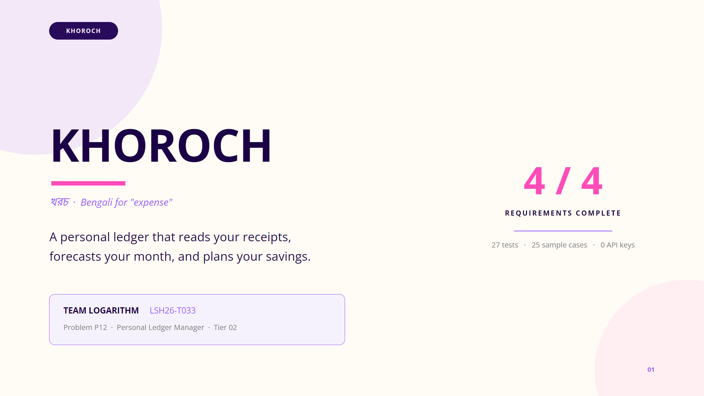
</p>

## Solution summary

A single-page web application that tracks a monthly salary against real spending. Expenses can be
typed in or read from a photograph of a bill, with the amount, date and shop shown for checking and
correction before anything is saved. From those figures it produces a monthly dashboard, a forecast
of where the month will end, written insights that cite the user's own categories and amounts, and
savings pockets whose completion dates come from that forecast alongside what a DPS at a stated rate
would return over the same period.

Everything runs in the browser. There is no account, no server, no database and no API key, so a
judge can open the live URL, load any of the 25 published sample cases from the header, and exercise
all four requirements within about a minute.

---

## System architecture

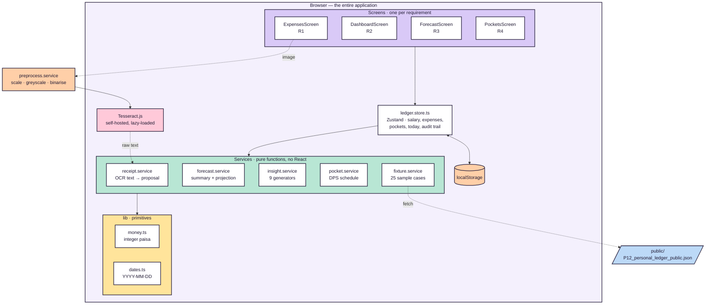

The layering is strict: **screens → store → services → storage**. A screen never computes money and
never reaches storage directly; a service imports nothing from React and touches no DOM. That is why
every engine can be exercised by the Node test runner with no browser, no bundler and no mocking —
and why a build of this length has a real test suite rather than a token one.

| Requirement | Engine | Screen |
| --- | --- | --- |
| R1 — receipts | `receipt.service.ts` | `ExpensesScreen.tsx` |
| R2 — dashboard | `forecast.service.ts` (`buildMonthSummary`) | `DashboardScreen.tsx` |
| R3 — forecast & insights | `forecast.service.ts` + `insight.service.ts` | `ForecastScreen.tsx` |
| R4 — pockets & DPS | `pocket.service.ts` | `PocketsScreen.tsx` |

---


<p align="center">
  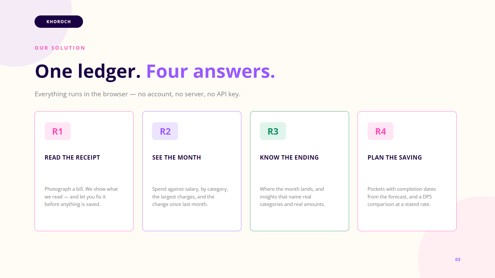
</p>

## Verifying the four requirements in five minutes

Open the live application and pick **`PUB-01`** from the *Load a sample case…* dropdown in the
header. Every figure below is what that case should produce, so each one can be checked against the
screen. The tabs are labelled `R1`–`R4` to match the requirements.

### R1 — Salary, expenses, and reading a bill photo → the **Expenses & receipts** tab

> *"Let the user set a monthly salary and add expenses, including by uploading a photo of a bill or
> receipt. Read the amount, date and shop name from the image, show what was read so the user can
> check it, and let them correct any field before saving."*

The requirement's weight is on the second half — the read must be **shown**, and every field must be
**correctable**. So the review step is mandatory and sits between reading and saving:

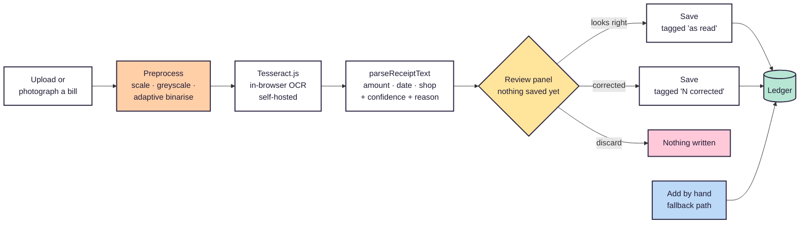

Walking it:

1. **Salary** is the first card. `PUB-01` loads it at `৳50,000.00`; change it and every figure on the
   other tabs follows.
2. **Add an expense from a receipt photo** — choose any bill image, or photograph one on a phone.
   The image is first straightened for the engine (scaled, greyscaled, and binarised against a local
   average so uneven lighting does not erase half the text), then read entirely inside the browser.
   A hostile fixture — a receipt at an angle, on grey paper, under a directional light — reads
   correctly in about two seconds.
3. When it finishes, **nothing has been saved**. The review panel shows the uploaded image; the
   amount, date, shop and category as **editable fields**; a badge per field — **read clearly**,
   **please check** or **not found**; a note per field explaining the decision (*"read from the line
   containing 'total'"*, *"day-first date (the first part is above 12)"*, *"first line of the
   receipt"*); and **Show the raw text that was read**, revealing exactly what the OCR engine
   returned.
4. Correct anything wrong, then **Save this expense**. The row appears in *All expenses* tagged
   `receipt · 2 corrected` or `receipt · as read`, so the correction becomes part of the record.
5. **Add an expense by hand** is the third card, and the fallback if a receipt will not read.

**What makes the parser worth a second look.** It does not take the largest number on the receipt.
Given the fixture below, a naive reader returns `2000.00`; this one returns `1580.78`:

```
Subtotal      1505.50
VAT 5%          75.28
TOTAL         1580.78   <-- chosen: names a total, and is not a subtotal/tax/cash line
Cash          2000.00   <-- larger, but excluded: cash tendered
Change         419.22   <-- excluded: change given
```

Ambiguous dates are handled honestly rather than confidently. `14/04/2026` is reported at high
confidence because `14` cannot be a month; `05/04/2026` is read day-first as is usual in Bangladesh
but marked **please check**, because the app cannot actually know.


<p align="center">
  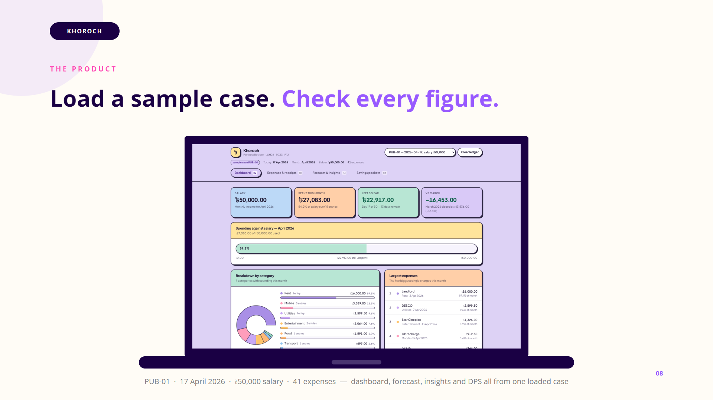
</p>

### R2 — Monthly dashboard → the **Dashboard** tab

> *"Show a monthly dashboard: total spent against salary, a breakdown by category, the largest
> expenses, and the change compared to last month."*

On `PUB-01` (17 April 2026), expect:

| Element | Value |
| --- | ---: |
| Salary | `৳50,000.00` |
| Spent this month | `৳27,083.00` — 54.2% of salary, 15 entries |
| Left so far | `৳22,917.00` — day 17 of 30 |
| Change vs March | `−৳16,453.00` — March closed at `৳43,536.00` |
| Largest single expense | `৳16,000.00`, Landlord, 3 Apr 2026 |

The comparison table below the bar chart carries **every category present in either month** —
including one that had spending last month and none this month, which is exactly the change a user
wants to see and the case a naive grouping silently drops. On `PUB-01`, Education
(`৳8,077.00 → ৳0.00`) and Health (`৳4,661.50 → ৳0.00`) are the proof.

### R3 — Forecast and written insights → the **Forecast & insights** tab

> *"Produce a forecast and written insights from the actual numbers: expected spending for the rest
> of the month, expected money left or short at month end, and at least three insights that name
> specific categories and amounts rather than giving general advice."*

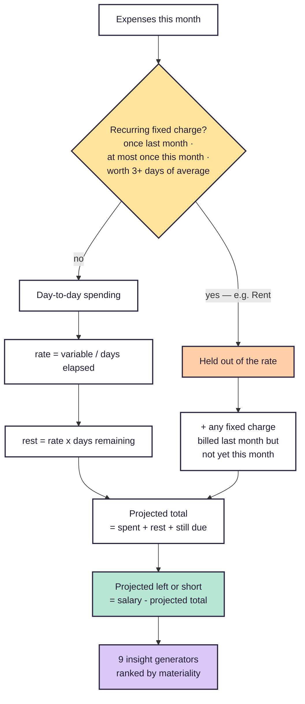

The card *How the forecast is calculated* prints this arithmetic on screen so it can be reproduced on
a calculator. On `PUB-01`:

```
Rent of 16,000.00 is a recurring fixed charge, held out of the daily rate
Day-to-day rate  = 11,083.00 / 17 days elapsed   =    651.94 per day
Rest of month    = 651.94 x 13 days remaining    =  8,475.22
Projected total  = 27,083.00 spent + 8,475.22    = 35,558.22
Projected left   = 50,000.00 - 35,558.22         = 14,441.78
```

Below it, **eight insights** — the requirement asks for three. Every one names real categories and
real amounts, because each generator reads the month summary and returns nothing when the data does
not support it: a generic sentence is not something this code can emit. They are ranked by how much
money each concerns. On `PUB-01` they include:

- *"Mobile is up ৳2,500.00 on last month"* — ৳3,589.00 against ৳1,089.00 in March, a rise of 229.6%.
- *"Groceries is down ৳7,713.00 on last month"* — ৳546.50 against ৳8,259.50.
- *"Rent, Mobile, Utilities are 82% of spending"* — ৳22,188.50 of ৳27,083.00 between them.


<p align="center">
  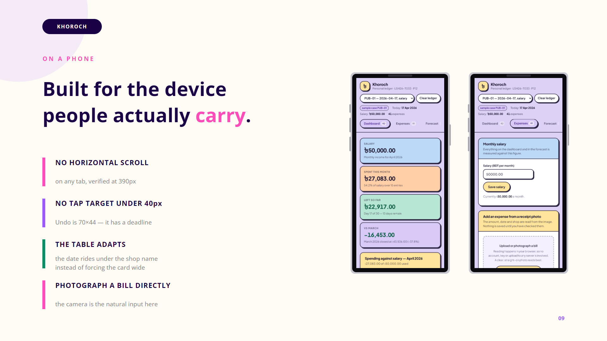
</p>

### R4 — Savings pockets → the **Savings pockets** tab

> *"Let the user create savings pockets for specific items, each with a name, a target amount, item
> details and a monthly contribution. For each pocket show an expected completion date based on the
> forecast, and what a DPS at a rate you state would return over that time."*

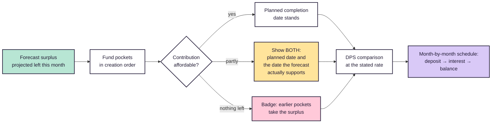

`PUB-01` loads three pockets — Wedding, Laptop and Bike — each with name, item details, target and
monthly contribution. Every card shows the target, the contribution, the **expected completion
month**, and what the same money would do in a **DPS at the stated rate** (8.00% for this case; the
rate is printed on every projection and again in its own card). Expand **Show the month-by-month DPS
schedule** for the deposit, interest and running balance of every month.

Two behaviours worth noticing, because both are places a submission can quietly mislead:

- **The completion date is tied to the forecast, not to wishful arithmetic.** `PUB-01`'s pockets ask
  for `৳41,000.00` a month while the forecast leaves `৳14,441.78`. The banner says so, and any pocket
  the forecast cannot fund shows **both** the planned completion date and the later one the numbers
  actually support.
- **Pockets are funded in creation order**, so a later pocket can be left with nothing even while a
  surplus exists. Its badge reads *earlier pockets take the surplus* rather than implying the money
  is not there at all.

---

## Resetting, and testing by hand

- **Load a sample case…** replaces the whole ledger with that case and sets the date the app treats
  as "today" to the case's own `today`. Switching cases is instant and repeatable.
- **Clear ledger** empties salary, expenses and pockets so the app can be driven from nothing.
  Re-selecting a case restores it exactly.
- State lives only in this browser's `localStorage`; a private window always starts clean.

---

## Data model

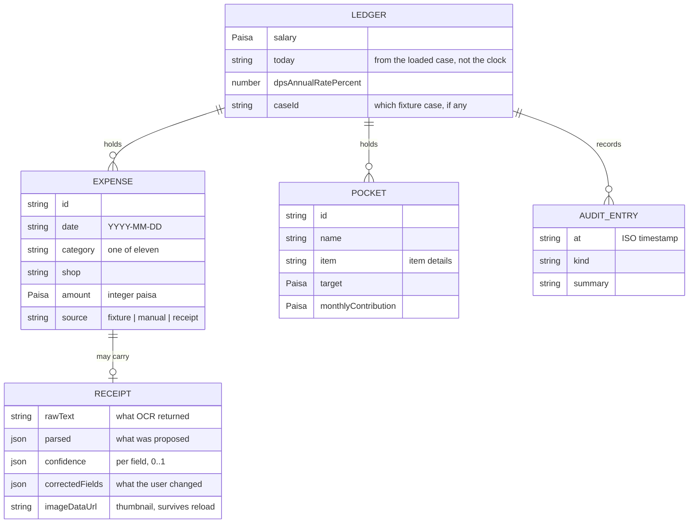

Two details in here are load-bearing. `amount` is **integer paisa**, never a float. And `today` is a
stored field rather than a call to the system clock, because the published cases are dated in 2026 —
using the real date would place every expense in the past and make every projection meaningless.

---

## Sample data

The published fixture is committed at
[`sample-data/P12_personal_ledger_public.json`](sample-data/P12_personal_ledger_public.json)
(25 cases, `PUB-01`–`PUB-25`, schema 2.1) and served **unmodified** from `public/` so the running
application can load it. A case supplies `today`, `months.last` / `months.this`, `salary_bdt`,
41–61 `expenses[]`, `pockets[]`, `dps_annual_rate_percent` and `dps_rule`. All money values are
decimal strings in BDT.

**DPS rule, applied verbatim from the fixture:** each month `balance = balance + deposit`, then
`interest = balance × rate / 12 / 100`, rounded half up to the paisa and added to the balance, so
later months earn on accumulated interest.

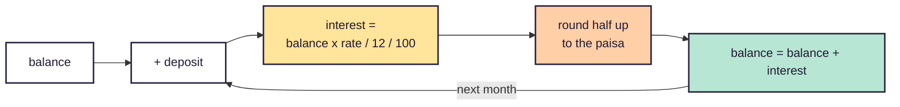

Worked check at 8.00% on a 20,000.00 monthly deposit — these exact figures are asserted by the test
suite and appear in the Wedding pocket's schedule:

| Month | Deposit | Interest | Balance |
| --- | ---: | ---: | ---: |
| 1 | 20,000.00 | 133.33 | 20,133.33 |
| 2 | 20,000.00 | 267.56 | 40,400.89 |
| 3 | 20,000.00 | 402.67 | 60,803.56 |

Month 2 earns 267.56 rather than 133.33 because the 133.33 credited in month 1 is itself earning —
the whole point of the rule, and the reason the schedule is simulated month by month rather than
evaluated with a closed-form annuity formula, which would drift from the stated per-month rounding.

---

## Run locally

**Requirements:** Node.js 20 or newer, and npm.

```bash
git clone https://github.com/AuvroIslam/lsh26-t033-p12.git
cd lsh26-t033-p12
npm install
npm run dev          # http://localhost:5173
```

```bash
npm run build        # type-check with tsc, then build to dist/
npm run preview      # serve the production build
npm test             # 27 checks over the fixture, the forecast and the receipt parser
```

**Nothing needs configuring.** [`.env.example`](.env.example) exists only to record that the
application requires no environment variables: there is no API key, token or database URL, because
receipt reading happens in the browser and the ledger is held in `localStorage`.

**A judge can test everything without any paid account, and without a working network.** The OCR
engine, its WASM core and the English language data are all served from this application out of
`public/tesseract/` — nothing is fetched from a CDN at any point, so receipt reading works on
throttled venue wifi or fully offline, and no user's receipt image goes near a third party.

### Repository layout

```
src/
├── lib/                     Primitives with no dependencies
│   ├── money.ts             Integer-paisa arithmetic, half-up rounding, formatting
│   ├── dates.ts             Month and day helpers, all on YYYY-MM-DD strings
│   └── types.ts             Expense, Pocket, ReceiptRecord, LedgerState
├── services/                Pure business logic — no React import anywhere
│   ├── forecast.service.ts  Month summary, fixed/variable split, projection
│   ├── insight.service.ts   Nine insight generators, ranked by materiality
│   ├── receipt.service.ts   OCR text → checkable proposal with confidences
│   ├── pocket.service.ts    DPS schedule and completion dates
│   ├── fixture.service.ts   Loading the 25 published cases
│   └── __tests__/           27 assertions, run on plain Node
├── store/ledger.store.ts    Zustand store, localStorage, audit trail
├── screens/                 One screen per requirement
└── components/ui.tsx        Shared presentational pieces
```

---


<p align="center">
  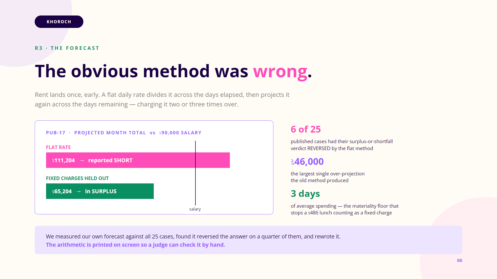
</p>

## Problem-solving approach

The four requirements reduce to **two engines with an interface around them**: a forecast that turns
spending so far into an expectation for the rest of the month, and a DPS schedule that turns a
monthly contribution into a balance over time. R2 displays the forecast's inputs, R3 explains its
output, and R4 feeds the DPS engine from it. Both were written as pure functions and tested against
the published fixture directly.

**The forecast went through one significant revision, and it is the part of this project we would
most want a judge to look at.** It began as a flat daily rate over all spending — the obvious
implementation, and wrong. Rent lands once and early, so dividing it across the days elapsed and then
re-projecting it across the days remaining charges it two or three times over. Measured across all 25
published cases, that inflated the projection by as much as `৳46,000.00` and **reversed the
surplus-or-shortfall verdict on six of the twenty-five**. `PUB-17` reported a `৳21,204.00` shortfall
for a month that in fact ends `৳24,796.00` in hand.

The projection is R3's central output, so a method that gets the *sign* wrong on a quarter of the
sample is not a rounding concern. Fixed charges are now identified from their billing shape — one
charge last month, at most one this month, and worth at least three days of average spending — and
held out of the daily rate. The materiality floor matters as much as the shape test: without it, a
single `৳486.00` lunch was classified as a fixed charge purely because the sample is sparse.
Detection reads the data rather than a hardcoded list of category names, so a hand-typed ledger with
unfamiliar categories behaves the same way as a loaded sample case. A regression test records that
the flat method called eight cases short where only two genuinely are.

The most important technical decision was to hold every amount as **integer paisa** rather than a
floating-point number of Taka. The fixture supplies decimal strings such as `856.50`, and the DPS
rule compounds monthly with half-up rounding at each step, so floating-point drift would surface in
exactly the figures a judge recomputes by hand. A test asserts that all 1,200-plus amounts across all
25 cases round-trip back to their original strings.

The second was that receipt reading must be **checkable rather than confident**. OCR on a photograph
is never reliable, so the parser returns a proposal, a per-field confidence and a note explaining its
reasoning, and the interface refuses to save until a person has seen it.

**Testing was done in two layers.** `npm test` runs 27 assertions over the pure logic and the entire
published fixture. Separately, the application was driven in a real browser — a generated receipt
image through the full read–review–save path, and all 25 cases across three screens checking for
crashes, `NaN` and missing insights. Several defects were found that way and not by the type checker:
a receipt thumbnail stored as a `blob:` URL that was already dead by the time anyone reloaded, a
donut chart rendering as an open arc, and a pocket badge that contradicted the banner above it.

---

## Technology used

| Layer | Choice |
| --- | --- |
| Frontend | React 19, TypeScript 5, Vite 8 |
| Styling | Tailwind CSS v4 |
| Charts | Recharts 2 |
| State | Zustand 5, persisted to `localStorage` |
| Receipt reading | Tesseract.js 5, in-browser |
| Testing | Node.js built-in test runner, plus Playwright-driven browser checks |
| Deployment | Vercel — static build, config in [`vercel.json`](vercel.json) |
| Backend / database | None by design |

**Resilience and feedback.** Each screen is wrapped in an error boundary keyed to its tab, so a
thrown render shows a recovery panel — and an escape route if the stored ledger itself is corrupt —
rather than the blank page React 19 otherwise leaves behind. Every action that changes money raises
a toast naming the amount, and deletions carry an **Undo**. The four screens are code-split, so the
initial download is 211 KB rather than the 674 KB it was when Recharts sat in the main bundle.

**Mobile.** Verified at 390px on every tab: no horizontal overflow anywhere, no interactive control
below a 40px tap target, and the expense table drops its date and source columns rather than forcing
the card wide, carrying the date under the shop name instead. The header condenses to two rows and
the tab labels shorten, while the full names are kept as `aria-label` so assistive technology does
not lose the requirement mapping on a narrow screen.

**Interface.** A soft neo-brutalist treatment: solid dark borders with hard, unblurred offset shadows,
rounded cards on a lavender ground, and a rotating pastel accent set. Money is the deliberate
exception — figures stay near-black on white, with colour carrying containers and category identity
instead. A ledger in which every number is tinted is a ledger nobody can scan.

### Colour

Two palettes, deliberately different: the **application** is a light neo-brutalist surface built for
reading numbers, and the **presentation** follows the event's reference deck.

**Application — Khoroch**

| Role | Hex | Used for |
| --- | --- | --- |
| Ground | `#DDD2F5` | The lavender page behind every card |
| Card | `#FFFFFF` | Card and input fills |
| Edge | `#2B2440` | Every border and the hard offset shadow — the backbone of the style |
| Ink | `#201A33` | All money figures and headings |
| Muted | `#6B6285` | Supporting copy |
| Mint | `#B8E6D4` | Positive: money left, funded pockets |
| Peach | `#FFCFA8` | Caution: spending, partly-funded pockets |
| Lilac | `#D9C9F7` | Accent: active tab, primary structure |
| Butter | `#FFE49B` | Primary action buttons |
| Blush | `#FFC9D9` | Negative: over salary, deletions |
| Sky | `#BCD9F7` | Neutral information |

Money figures stay near-black on white whatever the card is tinted. A ledger in which every number is
coloured is a ledger nobody can scan, so colour marks *containers* and *category identity* instead.

Categories carry a fixed pastel across the donut, the bars, the meters and the tables — Rent `#A98FE6`,
Groceries `#8ED9BB`, Food `#FFB877`, Transport `#8FC4F0`, Utilities `#C9A8F5`, Mobile `#FF9DBB`,
Health `#F78BA0`, Education `#7FD4DD`, Entertainment `#FFC46B`, Clothing `#B8DD7A`, Other `#B9B2CC` —
each outlined in the same `#2B2440` edge, which is what lets tones this soft sit next to each other.

**Presentation deck**

| Role | Hex | Source |
| --- | --- | --- |
| Ground | `#FFFCF6` | Cream, from the event reference deck |
| Ink | `#1A0044` | Deep indigo — headlines and body |
| Accent | `#9859FF` | Violet — accent words, corner blobs, page numbers |
| Secondary | `#FE4CB9` | Magenta — emphasis and the eyebrow labels |
| Supporting | `#808080` | Secondary copy |
| Positive | `#0A8F63` | Correct values and passing evidence |

Typography is **Open Sans** in the deck (matching the reference) and **Plus Jakarta Sans** in the
application.

See [`LICENSES.md`](LICENSES.md) for all third-party material.

---

## Team contributions

Work was divided by requirement so that each member owned a vertical slice — the engine, its screen,
and the evidence for it — rather than splitting along a frontend/backend line that this project does
not have.

| Registered member | GitHub | Major contribution | Evidence |
| --- | --- | --- | --- |
| **Oitijya Islam Auvro** | `AuvroIslam` | **Team lead, R2 and delivery.** Repository setup, the submission-kit records and the published fixture. Owned the **monthly dashboard** — the category breakdown, largest expenses and the month-on-month comparison, including carrying forward categories that fell to zero. Wrote the fixture loader and the case picker that lets a judge switch between all 25 cases. Coordinated the submission and the presentation deck. | `3410393`, `c6e2afe`, `9665570`; `src/screens/DashboardScreen.tsx`, `src/services/fixture.service.ts` |
| **Md. Nafiz Ahmed** | `Nafiz001` | **R1 and R4.** Owned **receipt reading** — the total/subtotal/cash discrimination, the day-first date handling, and the review panel that shows every parsed field with its confidence before anything is saved. Also owned **savings pockets and the DPS engine**, implementing the fixture's deposit-then-interest rule month by month in integer paisa. Built the image preprocessing that makes phone photos readable and self-hosted the OCR engine so it needs no network. | `src/services/receipt.service.ts`, `src/services/preprocess.service.ts`, `src/services/pocket.service.ts`, `src/screens/ExpensesScreen.tsx`, `src/screens/PocketsScreen.tsx` |
| **Dewan Salman Rahman Zisan** | `ripWr3ncH` | **R3 and correctness.** Owned the **forecast and the insight engine** — including measuring the original flat-rate method against all 25 cases, finding it reversed the verdict on six, and rewriting it around a fixed-versus-variable split. Built the integer-paisa money layer the whole app computes in, the 27-assertion test suite, and the browser verification that caught the dead thumbnail URL and the open-arc donut. | `b677a79`…`6376ff3`; `src/lib/money.ts`, `src/services/forecast.service.ts`, `src/services/insight.service.ts`, `src/services/__tests__/` |

Commit count alone does not represent contribution: the three members paired on the interface and on
review, and much of the work was done together at one screen. Both git author identities appearing in
the history belong to registered members; this is recorded in [`EVENT.md`](EVENT.md).

## AI usage

- **Claude (Anthropic), via Claude Code** — repository scaffolding, implementation and review during
  the event window. Output was read by the team, checked with `npm test` against the published
  fixture, and exercised in a browser before being accepted.
- **No AI service is called at runtime.** Receipt reading is Tesseract.js, a conventional OCR engine
  running locally in the browser. No user data leaves the device.

---

## Major design decisions

**Receipt reading runs in the browser, not through a hosted vision API.** A cloud model would read
more accurately, but it needs an API key and the rules forbid committing one — which would leave a
judge unable to exercise the feature at all. The requirement's weight is on showing what was read and
allowing correction, which this satisfies with no account and no runtime network dependency.

**All money is integer paisa.** Decimal strings in, integer arithmetic throughout, formatting only at
the edge. The DPS rule's per-month half-up rounding makes this a correctness requirement rather than
a preference.

**The forecast separates recurring fixed charges from day-to-day spending.** Justified in full above;
it changed the answer on six of twenty-five published cases.

**"Today" comes from the loaded case, not the system clock.** The published cases are dated in 2026;
using the real date would place every expense in the past and make every projection meaningless.

**No backend and no sign-in.** P12 is a single-person ledger with no sharing, so an account would put
a wall between a judge and the four requirements without changing one figure on screen.

**Insights are generated from the data, not selected from a list of advice.** Each generator reads the
month summary and returns nothing when unsupported, so an insight without a real category and amount
in it is not something the code can produce.

---

## Known limitations

- **The forecast needs two months of history to recognise a recurring charge.** A large purchase
  appearing for the first time this month cannot be distinguished from ordinary spending and is
  absorbed into the daily rate, which will push the projection up. A fixed charge that billed last
  month but has not yet appeared is added once at last month's amount, so a rent *rise* is not
  anticipated until it lands.
- **OCR accuracy depends on the photograph.** A skewed, blurred or low-contrast receipt may misread
  the amount or the date — which is why every field is editable and low-confidence fields are
  flagged. Handwritten receipts are generally not readable.
- **English receipt layouts only.** Bengali total keywords are recognised, but Bengali OCR is not
  enabled, so a wholly Bengali receipt will need manual correction.
- **Pockets are funded in creation order** when the forecast surplus cannot cover every contribution.
  Reordering priorities is not implemented; the interface states which pockets lose out and why.
- **The ledger is per-browser.** It lives in `localStorage` on one device, does not sync, and is lost
  if site data is cleared.
- **Two months are charted.** The dashboard compares the month containing "today" with the one before
  it, matching what the fixture supplies. Longer histories are not visualised.
- **OCR is a real engine, not a cloud model.** Tesseract with preprocessing reads a clean or
  moderately difficult receipt reliably, but a crumpled, heavily creased or very low-contrast
  photograph will still misread — which is exactly why every field is editable and why low-confidence
  fields are flagged rather than quietly accepted.

---

## Repository records

| File | Contents |
| --- | --- |
| [`EVENT.md`](EVENT.md) | Event start code, pre-event-material declaration, committer identities |
| [`evaluation-manifest.json`](evaluation-manifest.json) | Structured judging evidence |
| [`LICENSES.md`](LICENSES.md) | Every framework, library, font and asset used |
| [`sample-data/`](sample-data/) | The published fixture, unmodified |
| [`Khoroch-LSH26-T033-P12.pptx`](Khoroch-LSH26-T033-P12.pptx) | The presentation deck, also exported to [`docs/slides/`](docs/slides/) |

---

<p align="center">
  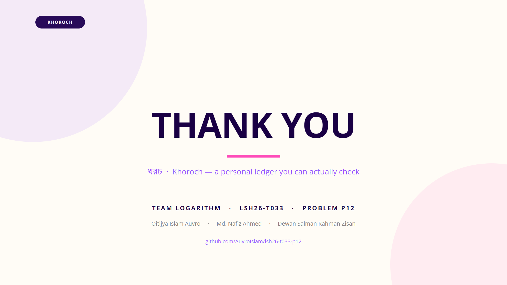
</p>
